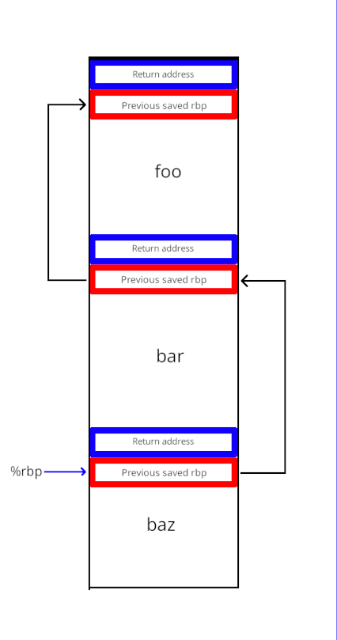

# Stack unwinding

We do very basic stack unwinding - our debugger is truly for _debug builds only_. Why? Because clang and gcc emits what is called the "frame base pointer". We need this (for now) to be able to know, not just what instruction (and therefore function) we're currently executing, but also where we are "further up" the call stack. Let's say we have

```cpp
int baz() {
  return 30; // we're stopped here
}

int bar() {
  return 20;
}

void foo() {
  int a = 10 + bar();
}

int main() {
  foo();
}
```

That means we have the call stack

- baz
- bar
- foo
- main
- (other system related frames)

If we inspect the program counter (instruction pointer register `%rip`), we can determine that we're in `baz` - but we need to find out where we are in the other places as well - otherwise we won't be much of a debugger. We read the register `%rbp`, because it points to the start of the `activation frame`, which is the "stack frame" where we place our variables. 8 bytes after this activation frame, the compiler has made sure to push the return address to the previous function. Another nifty thing is that, at the address of `%rbp`, if we read that memory, it will point to the _previous_ activation frame's start. And 8 bytes after that, is the return address of _that_ function and so on. That means we can start walking up the stack, by doing:

Some pseudo code:

```cpp
  const auto baz_frame_start = read_rbp_register();
  const auto baz_ret_address = read_value(baz_frame_start + 8);

  const auto bar_frame_start = read_value(baz_frame_start)
  const auto bar_ret_address = read_value(bar_frame_start + 8);

  const auto foo_frame_start = read_value(bar_frame_start)
  const auto foo_ret_address = read_value(foo_frame_start + 8);

  const auto main_frame_start = read_value(foo_frame_start)
  const auto main_ret_address = read_value(main_frame_start + 8);
```

This amounts to what basically looks like:

